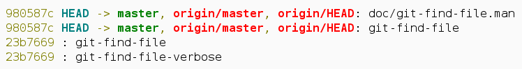

#git-find-file

A new git command to find files in git history

    $ git find-file -vcd git-find-file


##Installation

Download and symlink to your path

```bash
$ git clone https://github.com/albfan/git-find-file.git
$ cd git-find-file
$ ln -s $PWD/git-find-file ~/bin/
$ ln -s $PWD/git-find-file-verbose ~/bin/
```

or install with

```bash
$ ./autogen.sh && make && make check && sudo make install
```

## Usage

Check examples section on `--help` for usage

    $ git find-file <regex>
    $ git find-file --verbose <regex>
    $ git find-file --decorated <regex>
    $ git find-file -vcd <regex>

## Examples
 
    $ git find-file <regex>
    sha1
    sha2

    $ git find-file -v <regex>
    sha1: path/to/<regex>/searched
    sha1: path/to/another/<regex>/in/same/sha
    sha2: path/to/other/<regex>/in/other/sha

